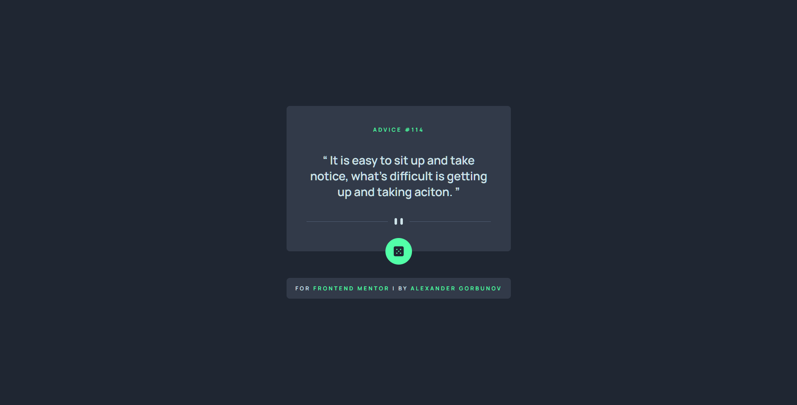
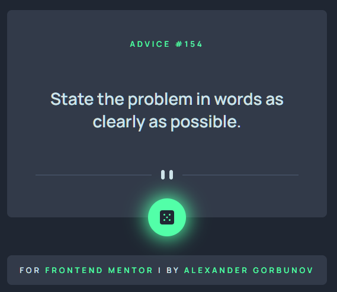
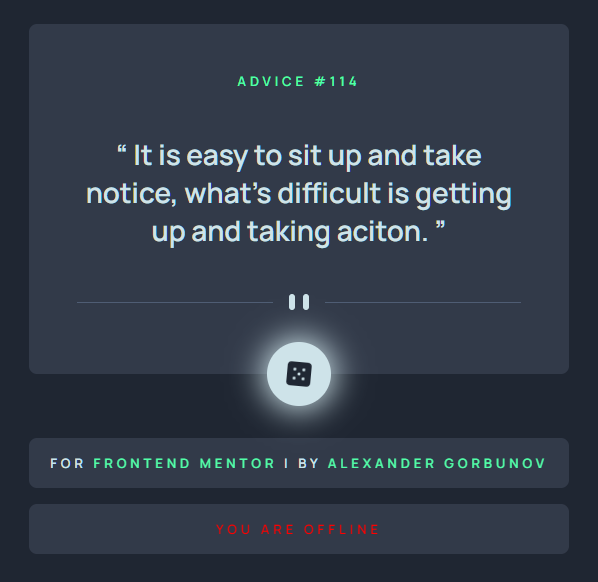
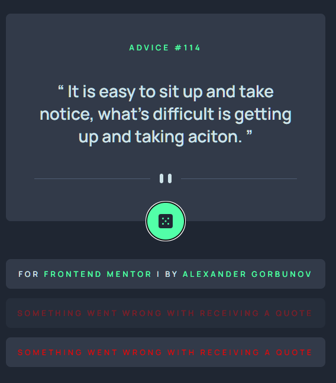

# Advice Generator App

<h3 align="center">
  <strong>
    <a href="https://arlagonix.github.io/projects/advice-generator-app-main/public">Open Demo in Github Pages</a>
  </strong>
</h3>

<p align="center">
  
</p>

<p align="center">
  
</p>

<p align="center">
  
  
</p>

## ℹ️ About

This is a solution to the [Advice generator app challenge on Frontend Mentor](https://www.frontendmentor.io/challenges/advice-generator-app-QdUG-13db).

The challenge is to build out this advice generator app using the [Advice Slip API](https://api.adviceslip.com) and get it looking as close to the design as possible.

See [Task.md](./docs/task.md) for more details about the task.

Users should be able to:

- View the optimal layout for the app depending on their device's screen size
- See hover states for all interactive elements on the page
- Generate a new piece of advice by clicking the dice icon

## ⚙️ Tools

- **HTML5**
  - Semantic HTML
- **SASS**
  - Flexbox
  - BEM methodology
  - Responsive design
  - Desktop first
- **JavaScript**
  - Work with API
- **Github Pages** - for hosting
- **VS Code**
  - _Live Server_ - VS Code extension that launches local servers
  - _Live Sass Complier_ - VS Code extension that transpiles SCSS/SASS files in CSS

## 📁 File Structure

<table>
  <tr>
    <th>Path</th>
    <th>Description</th>
  </tr>
  <tr>
    <td>public</td>
    <td>Folder with <code>.html</code> and <code>.css</code> files</td>
  </tr>
  <tr>
    <td>public / index.html</td>
    <td>Main HTML file</td>
  </tr>
  <tr>
    <td>public / index.css</td>
    <td>Main CSS file, generated with SCSS transpiler</td>
  </tr>
  <tr>
    <td colspan="2"></td>
  </tr>
  <tr>
    <td>src</td>
    <td>Source files needed for application development</td>
  </tr>
  <tr>
    <td>src / assets</td>
    <td>Images and other media used on the webpage</td>
  </tr>
  <tr>
    <td>src / index.scss</td>
    <td>Main SCSS file, used to later generate CSS</td>
  </tr>
  <tr>
    <td>src / index.js</td>
    <td>Main file with JS</td>
  </tr>
  <tr>
    <td>src / scripts</td>
    <td>Folder with JS functions imported by <code>index.js</code></td>
  </tr>
  <tr>
    <td colspan="2"></td>
  </tr>
  <tr>
    <td>docs</td>
    <td>Folder with additional information, documentation</td>
  </tr>
  <tr>
    <td>docs / images</td>
    <td>Folder with the application screenshots</td>
  </tr>
  <tr>
    <td>docs / images / goals</td>
    <td>Folder with images from Frontendmentor that show how the page should look like</td>
  </tr>
  <tr>
    <td>docs / images / results</td>
    <td>Folder with screenshots of how the application works after being fully developed</td>
  </tr>
  <tr>
    <td>docs / README-template.md</td>
    <td>Template for README.md, don't use it (from FrontendMentor)</td>
  </tr>
  <tr>
    <td>docs / style-guide.md</td>
    <td>Style information: color palette, fonts, etc. (from FrontendMentor)</td>
  </tr>
  <tr>
    <td>docs / task.md</td>
    <td>Detailed task description (from FrontendMentor)</td>
  </tr>
  <tr>
    <td>docs / advice-generator-app-main.zip</td>
    <td>Initial archive provided by Frontend Mentor</td>
  </tr>
  
</table>

## 💡 Details

### Working with API

```js
try {
  const result = await fetch(API_URL, {
    method: "GET",
  });
  const resultJSON = await result.json();

  // ...
} catch (err) {
  // ...
}
```

<hr>

### Button animation

There is a limitation described in the docs of API: it can generate new quotes only once in 2 seconds. Thus I disabled the button after the pressing, then enable it in 3 seconds. During these 2 seconds I show spinning animation

```scss
&__button[disabled] &__icon-dice {
  animation: rotate-360 3s infinite alternate ease-in-out;
}

&__button[disabled] {
  animation: shade-fade 3s forwards infinite alternate ease-in-out;
}

@keyframes rotate-360 {
  100% {
    transform: rotate(360deg);
  }
}

@keyframes shade-fade {
  0% {
    box-shadow: 0 0 32px 4px var(--primary-1);
  }

  100% {
    box-shadow: 0 0 0px 0px var(--primary-1);
  }
}
```

<hr>

### Quote and advice text animation

I achieved by toggling classes and adding a little `setTimeout`

```js
setTimeout(() => {
  removeClassFromElement(adviceText, "card__advice--out");
  removeClassFromElement(adviceId, "card__id--out");

  displayData(adviceId, resultJSON?.slip?.id ?? "-");
  displayData(
    adviceText,
    resultJSON?.slip?.advice ?? "Unable to get the quote."
  );

  addClassToElement(adviceText, "card__advice--in");
  addClassToElement(adviceId, "card__id--in");
}, 600); // 600ms helps to make all animations smooth - result of experiments
```

```scss
&__id--out {
  animation: shrink-out 0.8s forwards;
}

&__id--in {
  animation: shrink-in 0.8s forwards;
}

&__advice--out {
  animation: fade-out 0.8s forwards;
}

&__advice--in {
  animation: fade-in 0.8s forwards;
}

@keyframes fade-out {
  0% {
    transform: scale(1);
  }
  100% {
    transform: scale(0);
  }
}

@keyframes fade-in {
  0% {
    transform: scale(0);
  }
  100% {
    transform: scale(1);
  }
}

@keyframes shrink-out {
  0% {
    opacity: 1;
  }
  100% {
    opacity: 0;
  }
}

@keyframes shrink-in {
  0% {
    opacity: 0;
  }
  100% {
    opacity: 1;
  }
}
```

<hr>

### Offline and error notifications

If user goes offline, notification shows up and disappears when he is back online. Notifications fade in and fade out with animation.

When I add a notification to the page, it starts with 0 opacity, then by the end of animation the opacity is 1.

When I remove the notification from the page, launch the animation that slowly turns the opacity to 0, after some delay I delete the element from the page.

```js
addEventListener("offline", (event) => {
  disableElement(generateQuoteButton);
  const errorElement = displayError("You are offline");
  const checkOnline = setInterval(() => {
    const isOnline = window.navigator.onLine;
    if (isOnline) {
      enableElement(generateQuoteButton);
      clearInterval(checkOnline);
      errorElement.style.animation = "shrink-out 0.8s forwards";
      setTimeout(() => {
        removeElementFromPage(errorElement);
      }, 800);
    }
  }, 1000);
});
```

```js
try {
  ...
} catch (err) {
    const errorElement = displayError(
      "Something went wrong with receiving a quote"
    );
    setTimeout(() => {
      errorElement.style.animation = "shrink-out 0.8s forwards";
      setTimeout(() => {
        removeElementFromPage(errorElement);
      }, 800);
    }, 3000);
  }
```

```scss
@keyframes shrink-out {
  0% {
    opacity: 1;
  }
  100% {
    opacity: 0;
  }
}

@keyframes shrink-in {
  0% {
    opacity: 0;
  }
  100% {
    opacity: 1;
  }
}
```

<hr>

### Animated underline in links

Nothing special, thanks to https://tobiasahlin.com/blog/css-trick-animating-link-underlines/

```scss
&--link::before {
  content: "";
  position: absolute;
  display: block;
  width: 100%;
  height: 2px;
  border-radius: 2px;
  bottom: -2px;
  left: 0;
  background-color: var(--primary-2);
  transform: scaleX(0);
  transition: transform 0.5s ease;
}

&--link:hover::before {
  transform: scaleX(1);
}

&--description {
  font-size: 14px;
}
```

### Generate quotes from keyboard

```js
const generateQuoteButton = document.querySelector(".card__button");

/// ....

document.addEventListener("keydown", (e) => {
  switch (e.key) {
    case "Enter":
      generateQuoteButton.focus();
      generateQuoteButton.dispatchEvent("click");
      return;
  }
});
```

<hr>

### Figma prototype

I use a free version of FrontendMentor. Thus I don't have access to Figma prototypes. But that's not a problem - I made my own one

Here it is: https://www.figma.com/file/gtbZrKQzY4Ovlz9kQWeBPR/Advice-Generator-App?node-id=0%3A1

That helped me to make the application as close to the photos as possible

## 🔗 Useful resources

- [How to animate link underline](https://tobiasahlin.com/blog/css-trick-animating-link-underlines/)
- [Live server : VS Code extension](https://marketplace.visualstudio.com/items?itemName=ritwickdey.LiveServer)
- [Live SASS Complier : VS Code extension](https://marketplace.visualstudio.com/items?itemName=ritwickdey.live-sass)

## 👤 Author

- Frontend Mentor - [@GrbnvAlex](https://www.frontendmentor.io/profile/GrbnvAlex)
- Telegram - [@Arlagonix](https://t.me/Arlagonix)
- Github - [@arlagonix](https://github.com/arlagonix)
