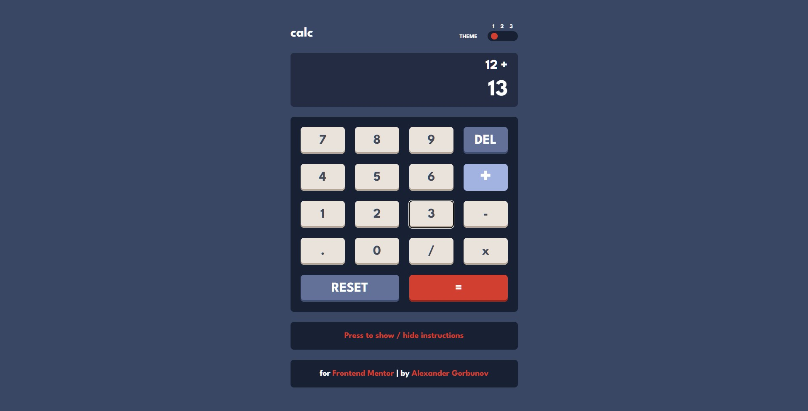
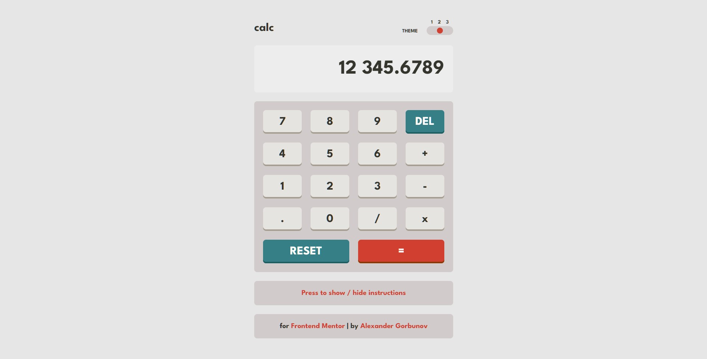
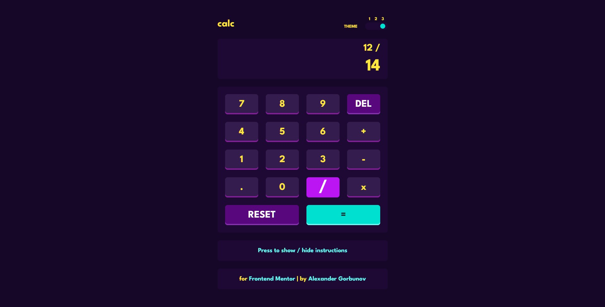
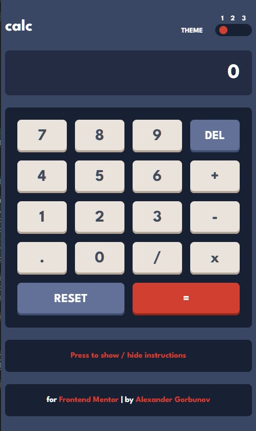

# Stats preview card component solution

<h3 align="center">
  <strong>
    <a href="https://arlagonix.github.io/projects/calculator-app-main/">Open Demo in Github Pages</a>
  </strong>
</h3>

<p align="center">
  
</p>

<p align="center">
  
</p>

<p align="center">
  
</p>

<p align="center">
  
</p>

## ℹ️ About

This is a solution to the [Calculator app challenge on Frontend Mentor](https://www.frontendmentor.io/challenges/calculator-app-9lteq5N29).

See [Task.md](./docs/task.md) for more details about the task.

Users should be able to:

- See the size of the elements adjust based on their device's screen size
- Perform mathmatical operations like addition, subtraction, multiplication, and division
- Adjust the color theme based on their preference
- **Bonus**: Have their initial theme preference checked using `prefers-color-scheme` and have any additional changes saved in the browser

## ⚙️ Tools

- **HTML5**
  - Semantic HTML
- **SASS**
  - Flexbox
  - Responsive design
  - Desktop first
- **JavaScript**
  - JSDoc - just describe what functions do with JSDoc styled comments
- **Github Pages** - for hosting
- **VS Code**
  - _Live Server_ - VS Code extension that launches local servers
  - _Live Sass Complier_ - VS Code extension that transpiles SCSS/SASS files in CSS

## 📁 File Structure

<table>
  <tr>
    <th>Path</th>
    <th>Description</th>
  </tr>
  <tr>
    <td>public</td>
    <td>Folder with <code>.html</code> and <code>.css</code> files</td>
  </tr>
  <tr>
    <td>public / index.html</td>
    <td>Main HTML file</td>
  </tr>
  <tr>
    <td>public / index.css</td>
    <td>Main CSS file, generated with SCSS transpiler</td>
  </tr>
  <tr>
    <td>public / index.css.map</td>
    <td>Generated with SCSS transpiler, might be used for debugging, i guess</td>
  </tr>
  <tr bgcolor="gray">
    <td colspan="2"></td>
  </tr>
  <tr>
    <td>src</td>
    <td>Source files needed for application development</td>
  </tr>
  <tr>
    <td>src / assets</td>
    <td>Images and other media used on the webpage</td>
  </tr>
  <tr>
    <td>src / index.scss</td>
    <td>Main SCSS file, used to later generate CSS</td>
  </tr>
  <tr>
    <td>src / styles</td>
    <td>Folder with SCSS partials, imported by <code>index.scss</code></td>
  </tr>
  <tr>
    <td>src / index.js</td>
    <td>Main file with JS</td>
  </tr>
  <tr>
    <td>src / scripts</td>
    <td>Folder with JS functions used imported by <code>index.js</code></td>
  </tr>
  <tr bgcolor="gray">
    <td colspan="2"></td>
  </tr>
  <tr>
    <td>docs</td>
    <td>Folder with additional information, documentation</td>
  </tr>
  <tr>
    <td>docs / images</td>
    <td>Folder with the application screenshots</td>
  </tr>
  <tr>
    <td>docs / images / goals</td>
    <td>Folder with images from Frontendmentor that show how the page should look like</td>
  </tr>
  <tr>
    <td>docs / images / results</td>
    <td>Folder with screenshots of how the application works after being fully developed</td>
  </tr>
  <tr>
    <td>docs / README-template.md</td>
    <td>Template for README.md, don't use it (from FrontendMentor)</td>
  </tr>
  <tr>
    <td>docs / style-guide.md</td>
    <td>Style information: color palette, fonts, etc. (from FrontendMentor)</td>
  </tr>
  <tr>
    <td>docs / task.md</td>
    <td>Detailed task description (from FrontendMentor)</td>
  </tr>
  
</table>

## 💡 Features

**First time creating a project with JavaScript**. I've been learning JS for the entire August 3-4 hours per day from Monday to Sunday. By the start of the September 2022 I decided to code something challenging. The result is successful. The hardest part was to work through the calculator logic. Learnt many things in the process of coding the logic, enjoyed it mostly.

<hr>

**Theme switcher**. Smooth, animated transition between 3 themes. A [video](https://www.youtube.com/watch?v=RiWxhm5ZdFM&t=1s&ab_channel=WebDevSimplified) from WebDev Simplified YouTube channel helped a lot to understand how it works.

Basically I just set the default variables for colors in `body` selector in CSS, then redefine this variables in separate classes. Then bind the adding and removal of classes from `body` HTML tag with JS.

Made toggle switch with a simple range input, styled it using [this article](https://www.w3schools.com/howto/howto_js_rangeslider.asp) from W3C.

Also added animation on hover - the ball smoothly shrinks on hover, changes its color. Couldn't find a way to animate transition between value, although unsure if that's needed.

<details><summary><em>HTML code for the switcher</em></summary>

```HTML
<input name="switcher" id="switcher" type="range" min="1" max="3" value="1" />
```

</details>

<details><summary><em>CSS for the switcher</em></summary>

```SCSS
#switcher {
  appearance: none;
  width: 4.5rem; // 72px
  height: 1.5rem; // 24px
  background: var(--switcher-background-color);
  outline: none;
  transition: 0.3s;
  border-radius: 1rem;
  padding: 0.5rem;
  cursor: pointer;

  // Yeah, they share the same styles, but
  // "selector 1, selector 2" just doesn't properly work in this case
  @mixin slider {
    width: 1rem;
    height: 1rem;
    background: var(--button-accent-background-color);
    border-radius: 1rem;
    transition: 0.3s;
  }

  &::-webkit-slider-thumb {
    @include slider;
    appearance: none;
  }

  &::-moz-range-thumb {
    @include slider;
  }

  &:hover::-webkit-slider-thumb {
    background: var(--button-accent-background-hover);
    transform: scale(0.85);
  }

  &:hover::-moz-range-thumb {
    background: var(--button-accent-background-hover);
    transform: scale(0.85);
  }
}
```

</details>

<details><summary><em>Switcher logic in JS</em></summary>

```JavaScript
// index.js
document.querySelector("#switcher").addEventListener("change", switcherHandler);
```

```JavaScript
// switcher.js
const switcherElement = document.querySelector("#switcher");
const themes = ["theme-1", "theme-2"];
/**
 * Changes the page theme depending on value of range input.
 * In order to change the theme the code adds or removes specific classes from `body` tag.
 *
 * @returns {undefined} `undefined`
 */
export function switcherHandler() {
  document.body.classList.remove(...themes);
  switch (+switcherElement.value) {
    case 1: // default theme
      break;
    case 2:
      document.body.classList.add(themes[0]);
      break;
    case 3:
      document.body.classList.add(themes[1]);
      break;
    default:
      break;
  }
  return;
}
```

</details>

<hr>

**SASS**. This time made just 2 files: `index.scss`, `_globals.scss`. Nesting of CSS selectors helps a lot! Decided not to use BEM this time. Didn't see much difference. HTML looks cleaner, but I faced some issues because of using id in HTML tags.

## 🔗 Useful resources

- [Normalize.css](github.com/necolas/normalize.css)
- [Live server : VS Code extension](https://marketplace.visualstudio.com/items?itemName=ritwickdey.LiveServer)
- [Live SASS Complier : VS Code extension](https://marketplace.visualstudio.com/items?itemName=ritwickdey.live-sass)

## 📍 Additional information

### Mobile first

Tried this time to style at first the layout for small screen sizes, then style the desktop layout (via media queries). It felt quite unusual, didn't see any difference with desktop first approach that I previously used. Although the project is rather small, so it might be strange if I could notice any difference.

### SASS file structure

It required some time to properly set it up. I didn't come to this idea on my own, used one article (lost it) as a foundation for my file structure, left only the necessary folders, so it's rather simple

I put all the stiles in a `styles` directory. Here is the structure of the folder

- `styles.scss` - contains all `use`. Sass team recommend to use `use` instead of `import`
- `styles.css` - generated CSS. Thanks to the VS Code plugin
- `styles.scss.map` - generated by the plugin, don't really know what it does
- `components` - a folder with all components in sense of BEM convention
  - `_component-name.scss` - a SASS partial - the code of the component itself
- `global` - a folder with global styles
  - `_colors.scss` - Contains definition of all colors in SASS variables
  - `_fonts.scss` - Imports all colors, contains definitions of font-families in SASS variables
  - `_globals.scss` - Contains global variables and styles
  - `_mixins.scss` - Mixins declaration
  - `_normalize.scss` - copied from github.com/necolas/normalize.css

### Animated Gradient Background

```html
<span class="text text--type_stats-value text--gradient">12M+</span>
</div>
```

The key fragment here is the class `text--gradient`. Just apply it to any text and boom! magic - the text is colored in gradient colors. The corresponding class is defined in `_text.scss`:

```scss
@use "../global/mixins";

.text {
  // Skipping the code
  &--gradient {
    @include mixins.moving-gradient-bg;
    background-clip: text;
    -webkit-text-fill-color: transparent;
  }
}
```

And the mixin is defined in the `_mixins.scss`:

```scss
@use "../global/colors";

@mixin moving-gradient-bg {
  background: linear-gradient(
    -90deg,
    colors.$gradient-1 0%,
    colors.$gradient-2 46%,
    colors.$gradient-3 100%
  );
  animation: gradient 10s ease infinite;
  background-size: 400% 400%;
  background-attachment: fixed;
}

@keyframes gradient {
  0% {
    background-position: 0% 0%;
  }
  50% {
    background-position: 100% 100%;
  }
  100% {
    background-position: 0% 0%;
  }
}
```

### Flexbox mixin

Quite an easy one, but it helped to keep the code DRY as soon as I use flexbox quite often

```scss
@mixin flex($align-items, $justify-content, $flex-direction) {
  display: flex;
  align-items: $align-items;
  justify-content: $justify-content;
  flex-direction: $flex-direction;
}
```

### Text components

The point is that every single piece of text on the page is an instance of a text component (in BEM convention). It helps to place all the text style definitions in one place. Thus it allows you to control your text styles globally from one place

I borrowed that idea from Figma that allows to define libraries for text styles. I thought it might be a great idea to try something like that in CSS

```scss
.text {
  font-family: fonts.$font-family-standard;
  color: colors.$secondary-white-1;
  font-size: $font-size-nm;

  &--type_header {
    font-family: fonts.$font-family-header;
    text-align: center;
    font-size: $font-size-lg;
    color: colors.$main-white;

    @media (min-width: globals.$break-point-lg) {
      text-align: left;
      font-size: $font-size-lg-lg;
    }
  }

  &--type_paragraph {
    color: colors.$secondary-white-1;
    text-align: center;
    line-height: 200%;

    @media (min-width: globals.$break-point-lg) {
      text-align: left;
    }
  }

  &--type_stats-value {
    font-size: $font-size-md;
    font-weight: 700;
    color: colors.$main-white;

    @media (min-width: globals.$break-point-lg) {
      text-align: left;
      font-size: $font-size-lg;
    }
  }
```

### Root `.scss` file

btw that's how it looks like:

```scss
@use "global/normalize";
@use "global/globals";

@use "components/page";
@use "components/text";
@use "components/main";
@use "components/picture-container";
@use "components/card";
@use "components/stats-item";
@use "components/link";
```

## 👤 Author

- Frontend Mentor - [@GrbnvAlex](https://www.frontendmentor.io/profile/GrbnvAlex)
- Telegram - [@Arlagonix](https://t.me/Arlagonix)
- Github - [@arlagonix](https://github.com/arlagonix)
