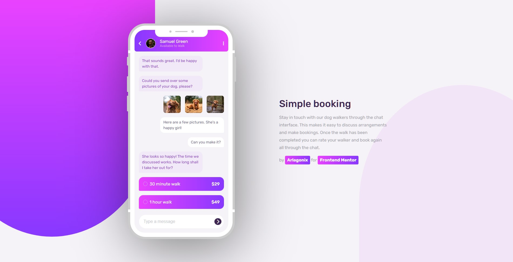
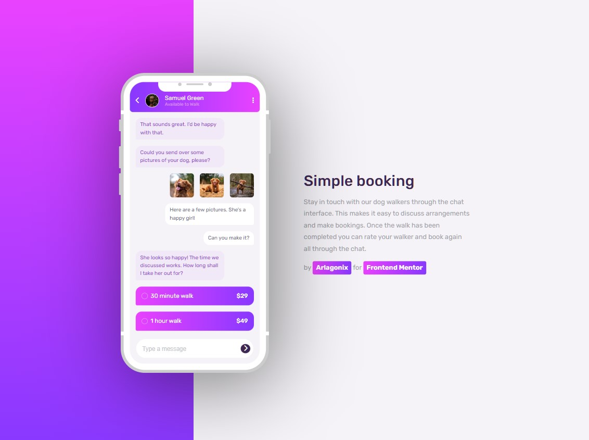
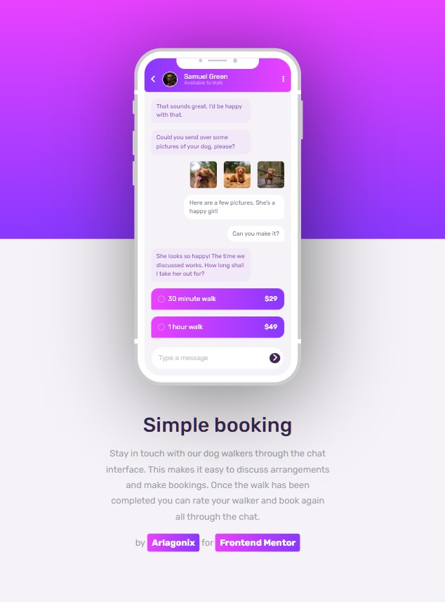

# Frontend Mentor - Chat app CSS illustration solution

This is a solution to the [Chat app CSS illustration challenge on Frontend Mentor](https://www.frontendmentor.io/challenges/chat-app-css-illustration-O5auMkFqY). Frontend Mentor challenges help you improve your coding skills by building realistic projects.

## Table of contents

- [Overview](#overview)
  - [The challenge](#the-challenge)
  - [Screenshot](#screenshot)
  - [Links](#links)
- [My process](#my-process)
  - [Built with](#built-with)
  - [What I learned](#what-i-learned)
  - [Useful resources](#useful-resources)
- [Author](#author)
- [Acknowledgments](#acknowledgments)

## Overview

### The challenge

Users should be able to:

- View the optimal layout for the component depending on their device's screen size
- **Bonus**: See the chat interface animate on the initial load

### Screenshot

<p align="center">
  
</p>

<p align="center">
  
</p>

<p align="center">
  
</p>

### Links

- Solution URL: [Github](https://github.com/arlagonix/arlagonix.github.io/tree/main/projects/chat-app-css-illustration-master)
- Live Site URL: [Github Pages](https://arlagonix.github.io/projects/chat-app-css-illustration-master)

## My process

### Built with

- Semantic HTML5 markup
- CSS custom properties
- Flexbox

### What I learned

The biggest project so far. Spent about 10-12 hours on it.

**Learned to customize checkboxes**<br>
It took very much time. I thought it might be easier but still I succeeded. Used an example from W3C, modified it and integrated it in the solution

**Learned to create a nice iphone cover**<br>
Initially I replicated the cover from the task. It was easy. Decided to push it further, found some examples in Codepen, chose the best looking, modified it and inserted in the code. The result looks awesome, really glad that invested time into that.

**Learned to customize inputs**<br>
Not hard at all. It was a bit tough to insert a submit button inside an input. Made a wrapper, placed the input and the button inside the wrapper and absolutely positioned the button.

```html
<label class="enter-message">
  <input
    type="text"
    placeholder="Type a message"
    class="enter-message__input text text--chat-right"
  />
  <button class="enter-message__submit">
    <i class="fa-solid fa-chevron-right text"></i>
  </button>
</label>
```

**Learned how to create a bobbing animation on hover**<br>
Main drawback is that animation abruptly stops as soon as you stop hovering on an element. Don't know how to solve that issue.

```css
.message:hover,
.iphone__gallery-image:hover,
.price:hover {
  animation: small-and-big;
  animation-duration: 0.8s;
  animation-timing-function: ease-in-out;
  animation-iteration-count: infinite;
  animation-direction: alternate-reverse;
}

@keyframes small-and-big {
  50% {
    transform: scale(0.95);
  }
}
```

**Got some practice with the `zoom` CSS attribute**<br>
Used it to change the scale of the iphone for different widhts. Initially tried to used `transform: scale();` but it didn't work pretty well because the element continued to obtain the initial big space in the document. `zoom` solved that problem.

### Useful resources

- [Codepen : Node : CSS IPhone XS](https://codepen.io/nordchetbi/pen/XyzNyO?editors=1100) - Awesome IPhone design
- [w3schools: How to create custom checkboxes, radio buttons](https://www.w3schools.com/howto/howto_css_custom_checkbox.asp) - Helped to customize my radio buttons

## Author

- Frontend Mentor - [@GrbnvAlex](https://www.frontendmentor.io/profile/GrbnvAlex)
- Telegram - [@Arlagonix](https://t.me/Arlagonix)
- Github - [@arlagonix](https://github.com/arlagonix)
