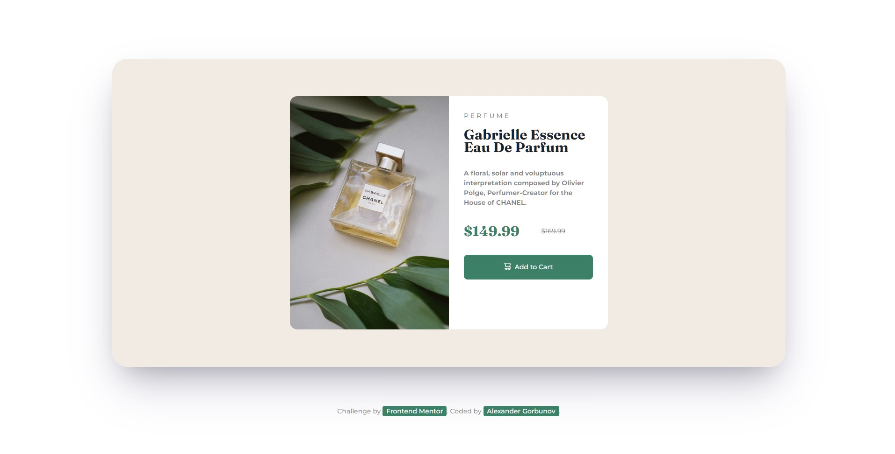
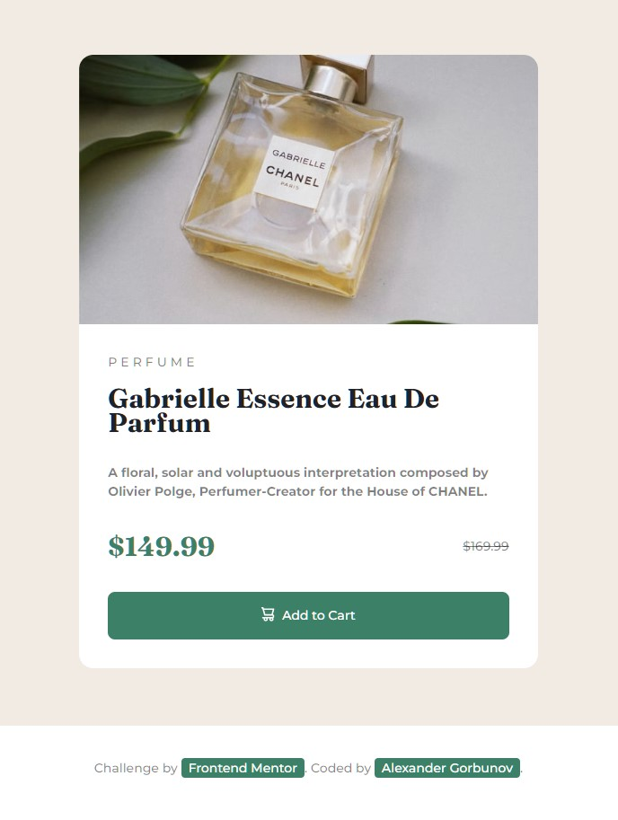

# Frontend Mentor - Product preview card component solution

This is a solution to the [Product preview card component challenge on Frontend Mentor](https://www.frontendmentor.io/challenges/product-preview-card-component-GO7UmttRfa). Frontend Mentor challenges help you improve your coding skills by building realistic projects.

## Table of contents

- [Overview](#overview)
  - [The challenge](#the-challenge)
  - [Screenshot](#screenshot)
  - [Links](#links)
- [My process](#my-process)
  - [Built with](#built-with)
  - [What I learned](#what-i-learned)
  - [Continued development](#continued-development)
  - [Useful resources](#useful-resources)
- [Author](#author)
- [Acknowledgments](#acknowledgments)

**Note: Delete this note and update the table of contents based on what sections you keep.**

## Overview

### The challenge

Users should be able to:

- View the optimal layout depending on their device's screen size
- See hover and focus states for interactive elements

### Screenshot



<p align="center">
  
</p>

### Links

- Solution URL: [Add solution URL here](https://github.com/arlagonix/arlagonix.github.io/tree/main/projects/product-preview-card-component-main)
- Live Site URL: [Add live site URL here](https://arlagonix.github.io/projects/product-preview-card-component-main/)

## My process

### Built with

- Semantic HTML5 markup
- CSS custom properties
- Flexbox

### What I learned

Use this section to recap over some of your major learnings while working through this project. Writing these out and providing code samples of areas you want to highlight is a great way to reinforce your own knowledge.

**Found out how to make nice button animations:**

```css
.button {
  transition: 0.3s;
}

.button:hover {
  background: var(--very-dark-blue);
  transform: scale(0.95);
  cursor: pointer;
}

.button:active {
  transform: scale(0.85);
}
```

**Animation on window resize**. Also found out that `transition: .3s;` helps to add nice animations on media queries when you resize the window.

**Appeared to be more difficult than expected**. It ocurred that such a simple card required much more time and effort to develop than I had thought. I still need more and more practice with CSS.

**Experimented with horizontal rulers**. That helped me not to set manually margins for each element. Saw such a solution on one project long ago.

```html
<article class="card__content">
  <p class="card__prod-type text">perfume</p>
  <hr class="hr" />
  <header>
    <h1 class="card__header" lang="fr">Gabrielle Essence Eau De Parfum</h1>
  </header>
  <hr class="hr hr--lg" />
  <p class="text text--style-bold">
    A floral, solar and voluptuous interpretation composed by Olivier Polge,
    Perfumer-Creator for the House of CHANEL.
  </p>
  <hr class="hr hr--lg" />
  <div class="card__prices">
    <p class="card__price">$149.99</p>
    <p class="card__old-price text"><del>$169.99</del></p>
  </div>
  <hr class="hr hr--lg" />
  <button class="button text">
    
    Add to Cart
  </button>
</article>
```

```css
.hr {
  border: 0;
  margin: 0.5rem 0;
}

.hr--lg {
  margin: 1rem 0;
}
```

**Tried to use BEM**. Well, it ocurred to be better than my previous custom solutions. It added order to the code, helped to clearly distinguish html from css via classes. Previously I used tag selectors, descendant selectors in css, found that such approach made the code more difficult to read.

**Flexbox is a great instrument!**

### Continued development

Use this section to outline areas that you want to continue focusing on in future projects. These could be concepts you're still not completely comfortable with or techniques you found useful that you want to refine and perfect.

**Note: Delete this note and the content within this section and replace with your own plans for continued development.**

### Useful resources

Stackoverflow helped to cover some issues.

## Author

- Frontend Mentor - [@GrbnvAlex](https://www.frontendmentor.io/profile/GrbnvAlex)
- Telegram - [@Arlagonix](https://t.me/Arlagonix)

## Acknowledgments

Thanks to the Frontend Mentor team for helping other people to master their web development skills!
