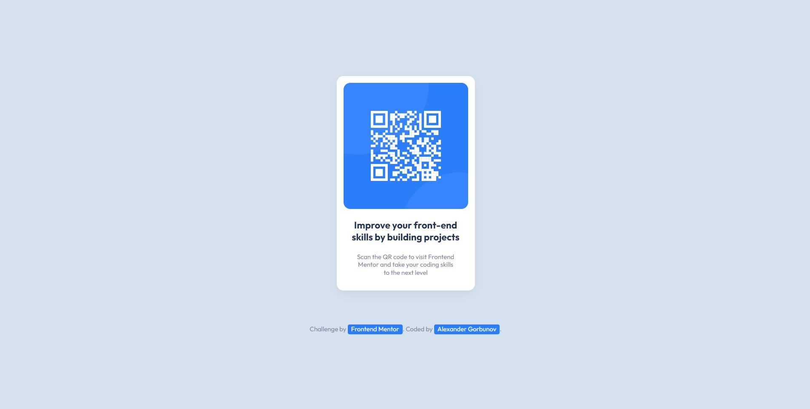

# Frontend Mentor - QR code component solution

This is a solution to the [QR code component challenge on Frontend Mentor](https://www.frontendmentor.io/challenges/qr-code-component-iux_sIO_H). Frontend Mentor challenges help you improve your coding skills by building realistic projects.

## Table of contents

- [Overview](#overview)
  - [Screenshot](#screenshot)
  - [Links](#links)
- [My process](#my-process)
  - [Built with](#built-with)
  - [What I learned](#what-i-learned)
- [Author](#author)

## Overview

### Screenshot



### Links

- Solution URL: [Github](https://github.com/arlagonix/arlagonix.github.io/tree/main/projects/qr-code-component-main)
- Live Site URL: [Github Pages](https://arlagonix.github.io/projects/qr-code-component-main/)

## My process

### Built with

- Semantic HTML5 markup
- CSS custom properties
- Flexbox

### What I learned

**Discoverd way to use filter on hover:**

```css
.card__image:hover {
  transform: scale(1.25);
  cursor: pointer;
  filter: hue-rotate(45deg);
}
```

**Discovered (via Google) a way to make items undraggable:**

```css
.card__image {
  -webkit-user-drag: none;
}
```

**Finally found a way to resize images so they don't jump out of the frame**

I placed the image in a container and set `overflow: hidden;` for the container. And what's about animation:

```css
.card__image:hover {
  transform: scale(1.25);
  cursor: pointer;
  filter: hue-rotate(45deg);
}

.card__image:active {
  transform: scale(1);
}
```

## Author

- Frontend Mentor - [@GrbnvAlex](https://www.frontendmentor.io/profile/GrbnvAlex)
- Telegram - [@Arlagonix](https://t.me/Arlagonix)
- Gihub - [@arlagonix](https://github.com/arlagonix)
