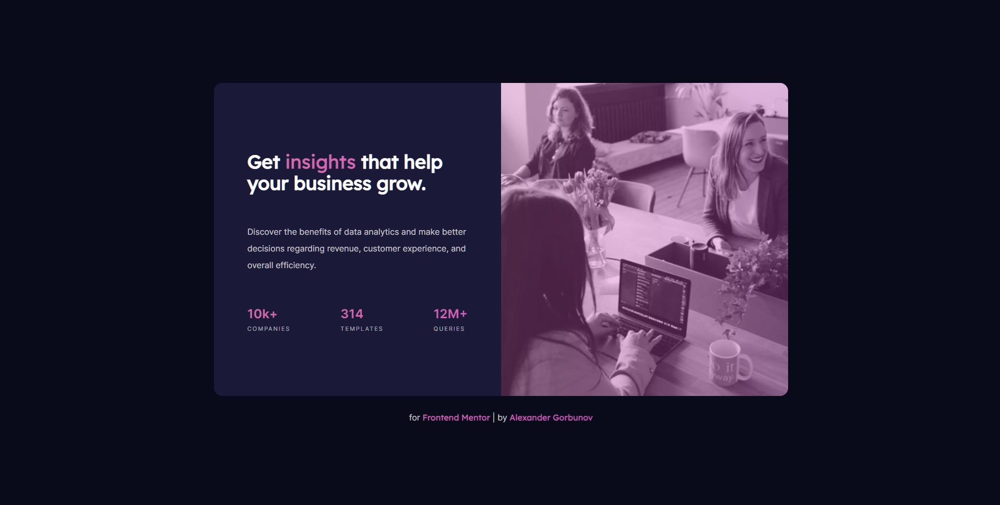

# Stats preview card component solution

<h3 align="center">
  <strong>
    <a href="https://arlagonix.github.io/projects/order-summary-component-main/">Open Demo in Github Pages</a>
  </strong>
</h3>

<p align="center">
  
</p>

<p align="center">
  
</p>

## ℹ️ About

This is a solution to the [Order summary card challenge on Frontend Mentor](https://www.frontendmentor.io/challenges/stats-preview-card-component-8JqbgoU62).

See [Task.md](./Task.md) for more details about the task

- **Build out a stats preview card**.
  - `/design` - Folder with designs. Contains both a mobile and a desktop version of the design.
  - `/images` - Folder with assets. The assets are already optimized.
  - `style-guide.md` - File with the style information: color palette, fonts, etc.
- **Get it looking as close to the design as possible**.
- **Use any tools to like**. You can use any tools you like to help you complete the challenge\*\*. So if you've got something you'd like to practice, feel free to give it a go.
- **Your users should be able to**:
  - View the optimal layout depending on their device's screen size

## ⚙️ Tools

- **HTML5**
  - Semantic HTML
- **SASS**
  - Flexbox
  - Responsive design
  - BEM naming convention
- **Github Pages** - for hosting
- **Live Server** - VS Code extension that launches local servers
- **Live Sass Complier** - VS Code extension that transpiles SCSS/SASS files in CSS

## 💡 Features

- **Animated Gradient text**. The text (and links) is colored with animated gradient. And it is achieved with only one class!
- **Animated Gradient images**. The image is "colored" by animated gradient
- **Hover animation on image, links**. Hover on the image = it scales. Hover on links = shrink. Click on links = shrink even more. Made it already several times in other projects.
- **SASS**. That is my first experience of using SASS (`.scss` to be specific). And it was wonderful! Nesting, mixins, partials! Oh my! Decided to use `.scss` instead of `.sass` because the first variant helps to easily reuse the `.css` fragments and files found in the Internet
- **SASS file composition**. Divided code into separate files. See below the details about the structure
- **Mixins**. For flexblox, for gradient background. See examples below
- **Text components**. Similarly to how it is done in Figma I made a text component in BEM convention. I made so in many previous projects as an experiment. ALthough now I see that this experiment was rather successful
- **Normalization**. Found a `normalize.css` file in Github, included it into the project

## 🔗 Useful resources

- [Normalize.css](github.com/necolas/normalize.css)

## 📍 Additional information

### SASS file structure

It required some time to properly set it up. I didn't come to this idea on my own, used one article (lost it) as a foundation for my file structure, left only the necessary folders, so it's rather simple

I put all the stiles in a `styles` directory. Here is the structure of the folder

- `styles.scss` - contains all `use`. Sass team recommend to use `use` instead of `import`
- `styles.css` - generated CSS. Thanks to the VS Code plugin
- `styles.scss.map` - generated by the plugin, don't really know what it does
- `components` - a folder with all components in sense of BEM convention
  - `_component-name.scss` - a SASS partial - the code of the component itself
- `global` - a folder with global styles
  - `_colors.scss` - Contains definition of all colors in SASS variables
  - `_fonts.scss` - Imports all colors, contains definitions of font-families in SASS variables
  - `_globals.scss` - Contains global variables and styles
  - `_mixins.scss` - Mixins declaration
  - `_normalize.scss` - copied from github.com/necolas/normalize.css

### Animated Gradient Background

```html
<span class="text text--type_stats-value text--gradient">12M+</span>
</div>
```

The key fragment here is the class `text--gradient`. It's defined in `_text.scss`:

```scss
@use "../global/mixins";

.text {
  // Skipping the code
  &--gradient {
    @include mixins.moving-gradient-bg;
    background-clip: text;
    -webkit-text-fill-color: transparent;
  }
}
```

And the mixin is defined in the `_mixins.scss`:

```scss
@use "../global/colors";

@mixin moving-gradient-bg {
  background: linear-gradient(
    -90deg,
    colors.$gradient-1 0%,
    colors.$gradient-2 46%,
    colors.$gradient-3 100%
  );
  animation: gradient 10s ease infinite;
  background-size: 400% 400%;
  background-attachment: fixed;
}

@keyframes gradient {
  0% {
    background-position: 0% 0%;
  }
  50% {
    background-position: 100% 100%;
  }
  100% {
    background-position: 0% 0%;
  }
}
```

### Card image animation with `hue-rotate`

```css
.card__bg:hover .card__bg-image {
  transform: scale(1.25);
  filter: hue-rotate(45deg);
}

.card__bg:active .card__bg-image {
  transform: scale(1);
  filter: hue-rotate(90deg);
}
```

### Moving background

Removed unnecessary properties

```css
.page {
  background: linear-gradient(
    60deg,
    rgba(84, 58, 183, 1) 0%,
    rgba(0, 172, 193, 1) 100%
  );
  animation: gradient 15s ease infinite;
  background-size: 400% 400%;
  background-attachment: fixed;
}

@keyframes gradient {
  0% {
    background-position: 0% 0%;
  }
  50% {
    background-position: 100% 100%;
  }
  100% {
    background-position: 0% 0%;
  }
}
```

## 👤 Author

- Frontend Mentor - [@GrbnvAlex](https://www.frontendmentor.io/profile/GrbnvAlex)
- Telegram - [@Arlagonix](https://t.me/Arlagonix)
- Github - [@arlagonix](https://github.com/arlagonix)
