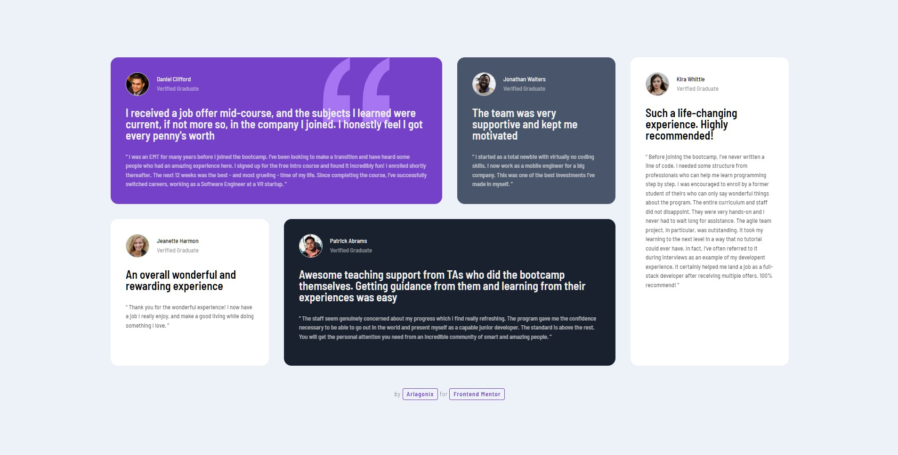
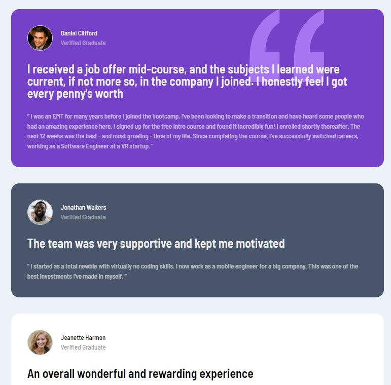

# Frontend Mentor - Testimonials grid section solution

This is a solution to the [Testimonials grid section challenge on Frontend Mentor](https://www.frontendmentor.io/challenges/testimonials-grid-section-Nnw6J7Un7). Frontend Mentor challenges help you improve your coding skills by building realistic projects.

## Table of contents

- [Overview](#overview)
  - [The challenge](#the-challenge)
  - [Screenshot](#screenshot)
  - [Links](#links)
- [My process](#my-process)
  - [Built with](#built-with)
  - [What I learned](#what-i-learned)
  - [Useful resources](#useful-resources)
- [Author](#author)

## Overview

### 📝 The challenge

Users should be able to:

- View the optimal layout for the site depending on their device's screen size

### 📷 Screenshot



<p align="center">
  
</p>

### 🔗 Links

- Solution URL: [Github](https://github.com/arlagonix/arlagonix.github.io/tree/main/projects/testimonials-grid-section-main)
- Live Site URL: [Github Pages](https://arlagonix.github.io/projects/testimonials-grid-section-main/)

## My process

### 🔧 Built with

- Semantic HTML5 markup
- CSS custom properties
- Flexbox
- CSS Grid

### 💡 What I learned

**Added nice transform animation**

```css
.card:hover .card__header {
  transform: translateY(-8px);
}

.card:hover .user {
  transform: translateY(4px);
}

.card:hover .card__review {
  transform: translateY(-16px);
}
```

**Had the first practical experience with grid.**
Flexbox is easier, tbh. Although for the cases similar to this task using grid looks like to a great choice.

### 🔗 Useful resources

- [Codepen: Hyperplexed](https://codepen.io/Hyperplexed/pen/vYpXNJd) - Got some inspiration for the hover animations
- [Codepen: Epogee Design](https://codepen.io/epogeedesign/pen/dyGOZoQ?editors=1100) - Got background gradient animation

## Author

- Frontend Mentor - [@GrbnvAlex](https://www.frontendmentor.io/profile/GrbnvAlex)
- Telegram - [@Arlagonix](https://t.me/Arlagonix)
- Github - [@arlagonix](https://github.com/arlagonix)
